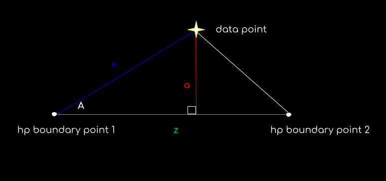

# Pixel Math Appendix
A reference document for the various utility functions of `hipscat/pixel_math`.

## Pixel Margins
The functions made to find the pixels that make up the border region of a given 
healpixel. Primarly used as a way to speed up the neighbor/margin caching code 
for [hipscat-import](https://github.com/astronomy-commons/hipscat-import/). Code 
originally created by Mario Juric for HIPS, found 
[here](https://github.com/mjuric/HIPS/blob/feature/multiprocess/hipscat/healpix.py).

### get_edge
Given a pixel pix at some order, return all
pixels order dk _higher_ than pix's order that line
pix's edge (or a corner).

pix: the pixel ID for which the margin is requested
dk: the requested order of edge pixel IDs, relative to order of pix
edge: which edge/corner to return (NE edge=0, E corner=1, SE edge = 2, ....)

#### Algorithm

If you look at how the NEST indexing scheme works, a pixel at some order is
subdivided into four subpixel at every subsequent order in such a way that the south
subpixel index equals `4*pix`, east is `4*pix+1`, west is `4*pix+2`, north is `4*pix+3`:

```
                4*pix+3
pix ->     4*pix+2    4*pix+1
                4*pix
```

Further subdivisions split up each of those sub pixels accordingly. For example,
the eastern subpixel (`4*pix+1`) gets divided up into four more:

```
S=4*(4*pix+1), E=4*(4*pix+1)+1, W=4*(4*pix+1)+2, N=4*(4*pix+1)+3

                                                            4*(4*pix+3)+3
                4*pix+3                             4*(4*pix+3)+2   4*(4*pix+3)+1
                                            4*(4*pix+2)+3   4*(4*pix+3)   4*(4*pix+1)+3
pix ===>  4*pix+2    4*pix+1  ===>  4*(4*pix+2)+2   4*(4*pix+2)+1   4*(4*pix+1)+2   4*(4*pix+1)+1
                                            4*(4*pix+2)    4*(4*pix)+3    4*(4*pix+1)
                4*pix                                4*(4*pix)+2   4*(4*pix)+1
                                                                4*(4*pix)
```
etcetera...

We can see that the edge indices follow a pattern. For example, after two
subdivisions the south-east edge would consist of pixels:
```
4*(4*pix), 4*(4*pix)+1
4*(4*pix+1), 4*(4*pix+1)+1
```
with the top coming from subdividing the southern, and bottom the eastern pixel.
and so on, recursively, for more subdivisions. Similar patterns are identifiable
with other edges.

This can be compactly written as:

```
4*(4*(4*pix + i) + j) + k ....
```

with i, j, k, ... being indices whose choice specifies which edge we get.
For example iterating through, i = {0, 1}, j = {0, 1}, k = {0, 1} generates 
indices for the 8 pixels of the south-east edge for 3 subdivisions. Similarly, 
for the north-west edge the index values would loop through {2, 3}, etc.

This can be expanded as:

```
4**dk*pix  +  4**(dk-1)*i + 4**(dk-2)*j + 4**(dk-3) * k + ...
```

where dk is the number of subdivisions. E.g., for dk=3, this would equal:

```
4**3*pix + 4**2*i + 4**1*j + k
```

When written with bit-shift operators, another interpretation becomes clearer:

```
pix << 6 + i << 4 + j << 2 + k
```

or if we look at the binary representation of the resulting number:

```
    [pix][ii][jj][kk]
```

Where ii, jj, kk are the bits of _each_ of the i,j,k indices. That is, to get the
list of subpixels on the edge, we bit-shift the base index pix by 2*dk to the left,
and fill in the rest with all possible combinations of ii, jj, kk indices. For example,
the northeast edge has index values {2, 3} = {0b10, 0b11}, so for (say) pix=8=0b1000, the
northeast edge indices after two subdivisions are equal to:

```
0b1000 10 10 = 138
0b1000 10 11 = 139
0b1000 11 10 = 148
0b1000 11 11 = 143
```

Note that for a given edge and dk, the suffix of each edge index does not depend on
the value of pix (pix is bit-shifted to the right and added). This means it can be
precomputed & stored for repeated reuse.

#### Implementation

The implementation is based on the binary digit interpretation above. For a requested
edge and dk subdivision level, we generate (and cache) the suffixes. Then, for a given
pixel pix, the edge pixels are readily computed by left-shifting pix by 2*dk places,
and summing (== or-ing) it with the suffix array.

### get_margin
Returns the list of indices of pixels of order (kk+dk) that
border the pixel pix of order kk.

#### Algorithm
Given a pixel pix, find all of its neighbors. Then find the
edge at level (kk+dk) for each of the neighbors.

This is relatively straightforward in the equatorial faces of the Healpix
sphere -- e.g., one takes the SW neighbor and requests its NE edge to get
the margin on that side of the pixel, then the E corner of the W neighbor,
etc...

This breaks down on pixels that are at the edge of polar faces. There,
the neighbor's sense of direction _rotates_ when switching from face to
face. For example at order=2, pixel 5 is bordered by pixel 26 to the
northeast (see the Fig3, bottom, https://healpix.jpl.nasa.gov/html/intronode4.htm).
But to pixel 5 that is the **northwest** edge (and not southwest, as you'd
expect; run `hp.get_all_neighbours(4, 26, nest=True)` and
`hp.get_all_neighbours(4, 5, nest=True)` to verify these claims).

This is because directions rotate 90deg clockwise when moving from one
polar face to another in easterly direction (e.g., from face 0 to face 1).
We have to identify when this happens, and change the edges we request
for such neighbors. Mathematically, this rotation is equal to adding +2
(modulo 8) to the requested edge in get_edge(). I.e., for the
pixel 5 example, rather than requesting SE=4 edge of pixel 26,
we request SE+2=6=NE edge (see the comments in the definition of _edge_vectors
near get_edge()).

This index shift generalizes to `2 * (neighbor_face - pix_face)` for the case
when _both_ faces are around the pole (either north or south). In the south,
the rotation is in the opposite direction (ccw) -- so the sign of the shift
changes. The generalized formula also handles the pixels whose one vertex
is the pole (where all three neighbors sharing that vertex are on different
faces).

#### Implementation
Pretty straightforward implementation of the algorithm above.

### pixel_is_polar
Because of the nature of spherical coordinate systems, hipscat runs into some tricky edge cases at the poles. To ensure we can appropriately handle those problems, we need to check if a pixel is one of the four 'polar pixels'.

#### Algorithm
In the ring id scheme for `healpix`, the first and last 4 pixels are the polar pixels. To determine whether a nest scheme pixel is at the poles, all we have to do is convert the pixel into the ring scheme and determine if it falls at the beginning or end of the range 0 -> npix. So, if in the ring scheme the pix is `<= 3`, or `>= npix - 4`, we can safely assume that it is a polar pixel.

## Margin Bounding
After constraining our data points using the `get_margin` code in `pixel_margins`, we then move on to our more accurate bound checking by calculating the distance between a given data point and the approximate boundaries of the healpixel.



To approximate this distance, we get the perpendicular bisector of the triangle made with the datapoint and the two closest boundary points. To find the the perpendicular bisector of this triangle (which is approximately the shortest distance between the data point and the healpix polygon), we will have to find

$\sin(a) = \sin(A)\sin(x)$

$a = \arcsin(\sin(A),\sin(x))$

where $a$ is the bisector, $x$ is the arc between our data point and one of the boundary points, and $A$ is the angle between that arc and the arc of the healpix boundary.

This identity comes from [Napier's rules for right spherical triangles](https://en.wikipedia.org/wiki/Spherical_trigonometry#Napier's_rules_for_right_spherical_triangles).

we already have $x$ from our separation calculations, but we're going to need to calculate the angle $A$. to do this, we can make use of the [spherical law of cosines](https://en.wikipedia.org/wiki/Spherical_law_of_cosines). let's use the identity

$\cos(y) = \cos(x)\cos(z) + \sin(x)\sin(z)\cos(A)$

from there we can solve for A with

$\sin(x)\sin(z)\cos(A) = \cos(y) - \cos(x)\cos(z)$

$\cos(A) = {\cos(y) - \cos(x)\cos(z) \over \sin(x)\sin(z)}$

$A = {\arccos({\cos(y) - \cos(x)\cos(z) \over \sin(x)\sin(z)})}$

and now we have all the information to find the bisector and compare it to our margin threshold! 
### check_margin_bounds
Given a set of ra and dec coordinates as well as the healpixel, healpix order, margin threshold, and the step value of sampled `healpy` boundaries, return a 1-dimmensional array of booleans on whether a given ra and dec coordinate pair are contained within any of the given bounding boxes.

#### Implementation
We take a chunk of our points and generate a set matrix of points with a shape (size_of_chunk, number_of_boundary_points) with all of our data points repeated along the first axis. Then, we generate a matrix of the same shape with the boundary points repeated as well and then put both of those matrices into a `SkyCoord` so that we can calculate the separations between all of them. We also find all of the distances between adjacent boundary points, so that we can find know the distance of each boundary segment. For each data point, we find the boundary point with the minimum separation, and then find which of the two adjacent boundary points has the smaller separation from the datapoint. From there, we can do the above calculations to get the perpendicular bisector and compare this against the `margin_threshold`. For checking around the corners of the healpixel, where the data point may not actually form a neat triangle with it's closest boundary points, we check to see if the minimum distance is less than the margin threshold and return True if it is. This way, we'll keep any data points that fall within the margin threshold but would return NaN with our perpendicular bisector calculations.

To speed up our calculations, the inner loops of calculations is compiled with the `numba` JIT compiler.

## HiPSCat ID

This index is defined as a 64-bit integer which has two parts:

* healpix pixel (at order 19)
* incrementing counter (within same healpix, for uniqueness)

Visually, in bits:

```
|------------------------------------------|-------------------|
|<-----    healpixel at order 19    ------>|<--   counter   -->|
```

This provides us with an increasing index, that will not overlap
between spatially partitioned data files.

### compute_hipscat_id

For a given list of coordinates, compute the HiPSCat ID s.t. coordinates in the
same order 19 pixel are appended with a counter to make a unique hipscat_id.

For the example, we'll work with the following simplified hex numbers to help 
illustrate: `[0xbeee, 0xbeef, 0xbeee, 0xfeed, 0xbeef]`

#### Counter construction

To construct our counters we sort the pixel numbers, call 
[numpy.unique](https://numpy.org/doc/stable/reference/generated/numpy.unique.html),
then do some silly arithmetic with the results.

The sorted representation of the above is `[beee, beee, beef, beef, feed]`. What 
we're looking for at this point is a counter that indicates if the value is being
repeated and how many times we've seen this value so far. e.g. `[0, 1, 0, 1, 0]`.

The `np.unique` call will yield three outputs:

* `unique_values` (ignored) `[beee, beef, feed]`
* `unique_indices` - the index of the *first* occurrence of each unique value.
    `[0, 2, 4]`
* `unique_inverse` - the indices of *all* occurrences of the unique values 
    (using indexes from that `unique_values`), used to reconstruct the 
    original array. `[0, 0, 1, 1, 2]`

By indexing into `unique_indexes` by the `unique_inverse`, we get an array with the 
index of the first time that healpix pixel was seen, which provides an step-like 
offset. e.g. `[0, 0, 2, 2, 4]`. This jumps up to the current index each time the
pixel changes. We subtract this from the actual index value (e.g. `[0, 1, 2, 3, 4]`)
to get the desired counter. e.g. 

```
[0, 1, 2, 3, 4]
-
[0, 0, 2, 2, 4]
=
[0, 1, 0, 1, 0]
```

#### Putting it together

After mapping our coordinates into order 19 healpix pixels, we bit-shift them to make room for our counters. Then we add the counters to the end.

e.g.

```
[     0xbeee,      0xbeee,      0xbeef,      0xbeef,      0xfeed]
           << shifted <<
[0x5F7700000, 0x5F7700000, 0x5F7780000, 0x5F7780000, 0x7F7680000]
+
[          0,           1,            0,          1,           0]
=
[0x5F7700000, 0x5F7700001, 0x5F7780000, 0x5F7780001, 0x7F7680000]
```

And finally, we unsort the array to get back the hipscat ids in the order the 
coordinates were provided.

`[0x5F7700000, 0x5F7780000, 0x5F7700001, 0x7F7680000, 0x5F7780001]`